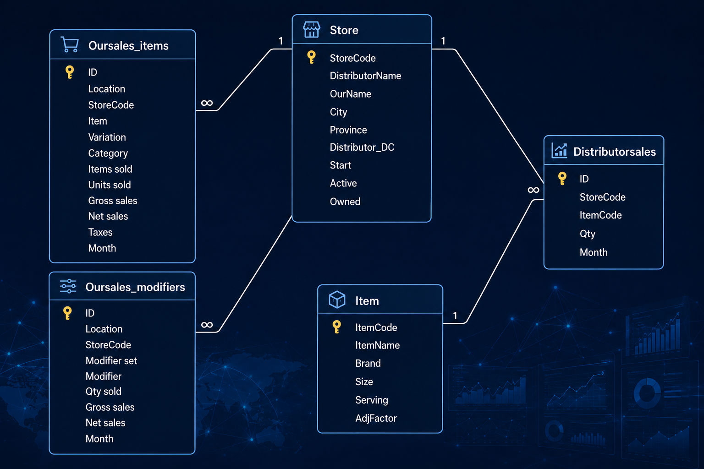

# SalesDB: Multi-Channel Sales Reconciliation & Supply Chain Analytics

## 📌 Project Overview
This project delivers an **operational SQL database solution** engineered for a multi-location **smoothie chain** to bridge the gap between B2C retail POS sales and B2B distributor logistics. 

By unifying disparate data sources, this database serves as a single source of truth to drive multi-channel sales reconciliation, master data alignment, and distributor ordering cycle forecasting.

---

## 🗂️ Core Database Schema & Data Dictionary

The database consists of the following key tables, engineered with clean relational constraints and data governance principles:

### 1. `Store` (Dimension Table)
The master registry of all store locations.
*   **`StoreCode`** (Short Text / PK): The official B2B store identification code borrowed directly from **Gordon Food Service (GFS)**, acting as the parent table's Primary Key.
*   **`GFSName`** (Short Text): Store name used by GFS.
*   **`OurName`** (Short Text): Store name as generated by the retail POS system (GoParrot).
*   **`City`** (Short Text): The city where the store is located.
*   **`Province`** (Short Text): The province where the store is located.
*   **`GFS_DC`** (Short Text): The GFS distribution center (DC) that supplies this store.
*   **`Active`** (Short Text): Indicates whether the store is currently operating.
*   **`Owned`** (Short Text): Indicates whether the store is company-owned.

### 2. `Item` (Dimension Table)
The master registry of products and packaging components.
*   **`ItemCode`** (Short Text / PK): The item code borrowed from **GFS** to serve as the parent table's Primary Key.
*   **`ItemName`** (Short Text): Detailed name/description of the item.
*   **`Brand`** (Short Text): The source of the product. "Snowbank" indicates products supplied by our company to GFS.
*   **`Size`** (Number): The number of pieces (pcs) or grams (g) contained in each case.
*   **`Serving`** (Number): The quantity of this product included in one serving sold to the customer.
*   **`AdjFactor`** (Number): Adjustment factor used in conversion rate calculations based on historical experience.

### 3. `Oursales_items` (Fact Table)
Raw transactional data from the retail POS system capturing main product sales. 
*   **`ID`** (AutoNumber / PK): Unique row identifier.
*   **`Location`** (Short Text): Store name used in the GoParrot reports (linked operationally to `Store.OurName`).
*   **`StoreCode`** (Short Text): GFS store code placeholder, updated via backend scripts to establish relational data alignment.
*   **`Item`** (Short Text): Main product name/category sourced from GoParrot.
*   **`Variation`** (Short Text): Product size or specific variant from GoParrot.
*   **`Category`** (Short Text): Product group classification from GoParrot.
*   **`Items sold`** (Number): Quantity of items sold at retail.
*   **`Units sold`** (Number): Total unit count sold.
*   **`Gross sales`** (Number): Gross revenue generated.
*   **`Net sales`** (Number): Net revenue after discounts.
*   **`Taxes`** (Number): Tax applied to the transaction.
*   **`Month`** (Date/Time): Transactional period. Uses the first day of each month (e.g., `2026/01/01`) to represent the month.

### 4. `Oursales_modifiers` (Fact Table)
Raw transactional data from the retail POS system capturing optional add-ons and toppings.
*   **`ID`** (AutoNumber / PK): Unique row identifier.
*   **`Location`** (Short Text): Store name used in the GoParrot reports.
*   **`StoreCode`** (Short Text): GFS store code placeholder, updated via backend scripts.
*   **`Modifier set`** (Short Text): Modifier group classification from GoParrot.
*   **`Modifier`** (Short Text): Specific add-on or topping name from GoParrot.
*   **`Qty sold`** (Number): Quantity of modifiers sold.
*   **`Gross sales`** (Short Text): Gross sales text field from GoParrot.
*   **`Net sales`** (Short Text): Net sales text field from GoParrot.
*   **`Month`** (Date/Time): Transactional period, formatted using the first day of the month.

### 5. `GFSsales` (Fact Table)
B2B wholesale distribution data tracking physical product shipments.
*   **`ID`** (AutoNumber / PK): Unique row identifier.
*   **`StoreCode`** (Short Text): The GFS store identification code (Foreign Key to `Store.StoreCode`).
*   **`ItemCode`** (Short Text): The official GFS item identifier (Foreign Key to `Item.ItemCode`).
*   **`Qty`** (Number): Actual wholesale volume shipped to the location.
*   **`Month`** (Date/Time): Fulfillment period, formatted using the first day of the month.

---

## 🚀 Business Applications & Impact

This analytics engine transitions operational workflows from manual spreadsheet checking to automated SQL-driven insights:

1.  **Cross-Channel Quantity Reconciliation**: Unifies disparate naming conventions by mapping text-based retail sales data to standardized GFS ItemCodes, allowing direct comparison with physical wholesale shipment volumes.
2.  **Automated Master Data Governance**: Implements automated exception monitoring to flag newly opened stores missing from the master registry, ensuring 100% data compliance before analysis.
3.  **B2B Order Cycle Forecasting**: Simulates window functions using advanced relational queries to calculate historical ordering frequency (order gaps) per item per store, directly optimizing supply chain stock management.
